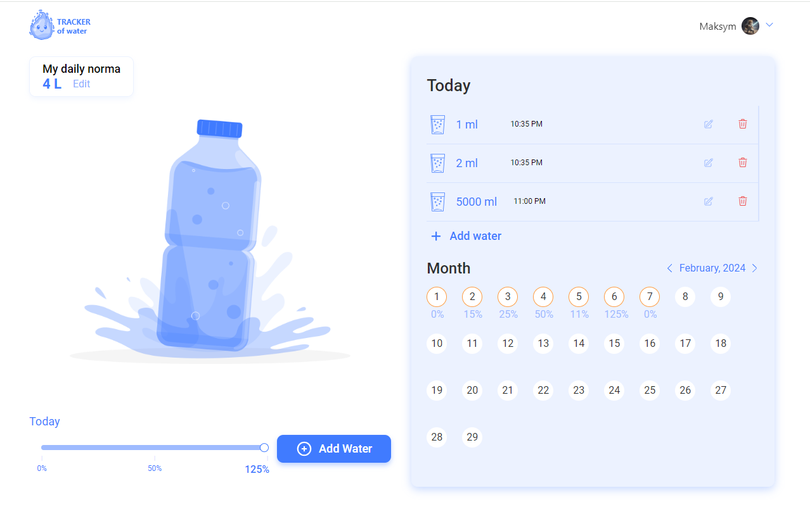

WaterTracker Project by CODECRAFTERS Team The CODECRAFTERS team has developed
the WaterTracker project - a tool designed to track daily water consumption.
This project aims to help individuals maintain proper hydration levels by
monitoring their water intake throughout the day.
 Team Members and
Responsibilities  Maksym Haidabura - Team Lead  Oleksandr Kalinovskyi -
Scrum Master, HomePage  Maksym Osovik - Back End Development  Dmytro
Shevchenko - Sign in, Sign up  Yurii Yakovchuk - Swagger Documentation 
Yurii Vovk - DailyNorma  Ruslana Matviienko - Header  Igor Lunyakin -
Setting  Anna Grigoreva - Today and WaterRatioPanel  Svitlana Liulka -
Calendar  Sergii Stratovych - Add water  Technologies Used  The
WaterTracker project utilizes the following technologies: 

Front End: React, Redux  Back End: MongoDB, Express, Mongoose 
Additional Tools: Nodemailer, emotion, mui/material, axios, formik,
react-toastify, styled-components, redux-persist

Live page - https://argojkee.github.io/dreamteam-water/login 
Back-repository - https://github.com/OsMax/dreamteam-water-server  Swagger -
https://dreamteam-water-server.onrender.com/api-docs/  Render -
https://dreamteam-water-server.onrender.com 

Usage  Installation  Clone the repository from the following link: 
WaterTracker Repository 

Navigate to the project directory 

Install dependencies 

npm install 

Running the project 

Start the server:  npm start 

Open your browser and navigate to the provided link. 

Contribution  The CODECRAFTERS team welcomes contributions from other
developers. If you'd like to contribute, please create a pull request or submit
an issue explaining your suggestions or changes.

License  This project is licensed under the GoIT Licence

Contacts: aik5787@gmail.com
